# Screenshots & Feature Guide

Visual documentation for the Git Interactive Rebase GUI Tool. Each section showcases a feature with a screenshot and brief description.

**Note:** [Vim official repository](https://github.com/vim/vim) is used for demonstration purposes.

---

## Table of Contents

1. [Launch](#1-launch)
2. [Main Interface](#2-main-interface)
3. [Context Menu](#3-context-menu)
4. [Search & Filter](#4-search--filter)
5. [Diff Viewer](#5-diff-viewer)
6. [File-wise View](#6-file-wise-view)
7. [Rephrase Commit](#7-rephrase-commit)
8. [Drop Commit](#8-drop-commit)
9. [Drag to Reorder](#9-drag-to-reorder)
10. [Squash Commit with above / below commit](#10-squash-commit-with-above--below-commit)
11. [Split Dialog](#11-split-dialog)
12. [Light Theme](#12-light-theme)
13. [Dark Theme](#13-dark-theme)
14. [Reset Options](#14-reset-options)
15. [Rebase Dialog](#15-rebase-dialog)
16. [Copy to Clipboard](#16-copy-to-clipboard)
17. [Zoom Controls](#17-zoom-controls)

---

## 1. Launch

Launch the application with options to choose the number of commits to view.

### Option 1: Selected number of HEAD commits
View only the most recent N commits.

```bash
python3 git_interactive_rebase.py <commit-sha>
python3 git_interactive_rebase.py HEAD~N
```

**Screenshot:** `screenshots/head-commits.png`

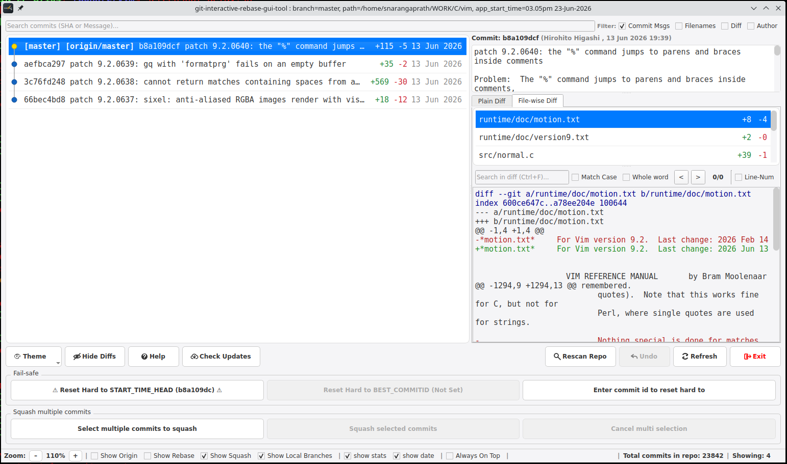

### Option 2: Full commit history
View all commits from the current branch. If no commit SHA is provided, shows up to 200 recent commits by default.

**Screenshot:** `screenshots/main-interface.png`

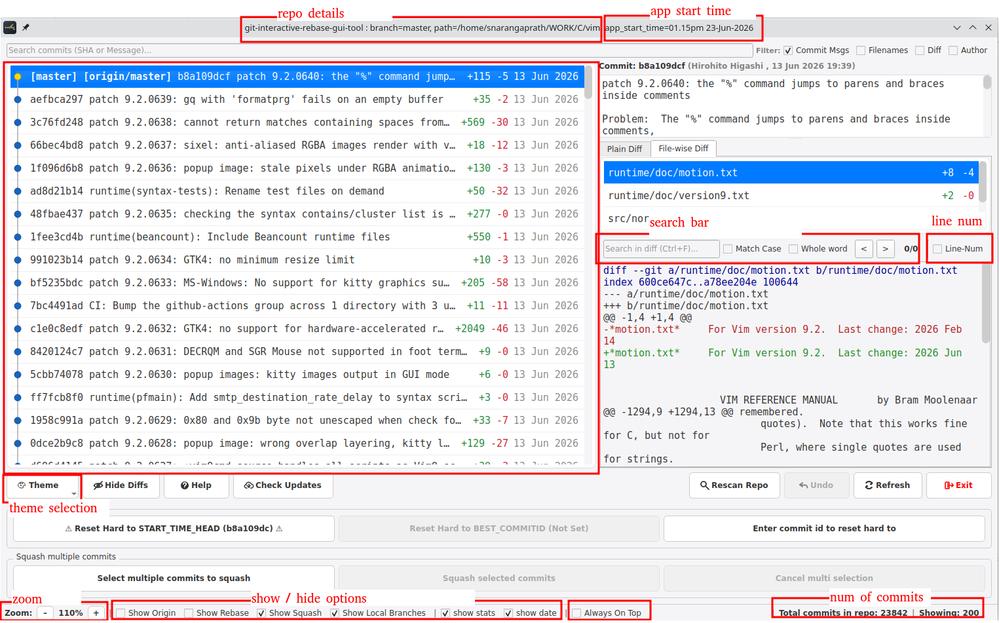

---

## 2. Main Interface

The main window displays your commit history in an interactive list with action controls.

**Screenshot:** `screenshots/main-interface.png`


**Description:** The main window shows the commit list with SHA, message, and branch indicators. The details panel displays commit metadata (SHA, author, date, changed files). The right side pane shows diffs in plain view or file-wise view. The top toolbar includes search, theme toggle, zoom controls, and reset options. Right-click any commit to access the context menu with all rebase actions.

---

## 3. Context Menu

Access all commit actions via right-click menu.

**Screenshot:** `screenshots/context-menu.png`

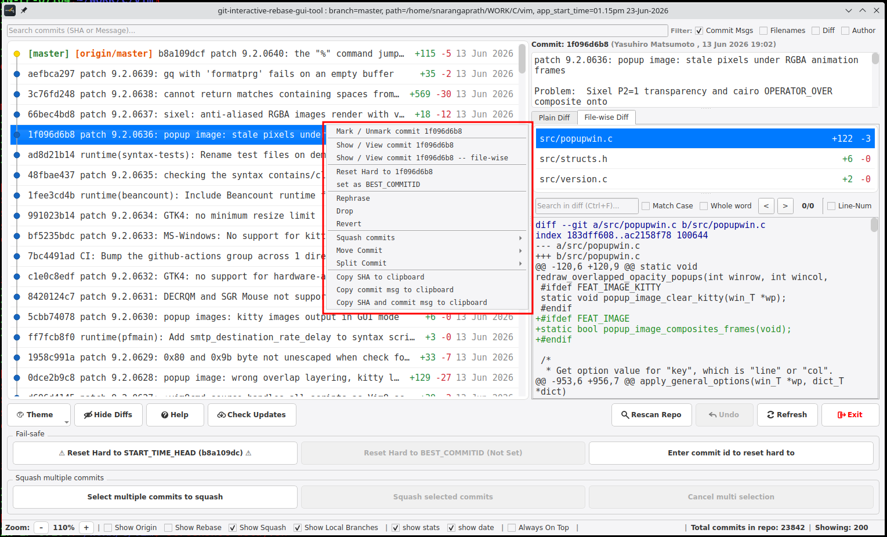

**Description:** Right-click any commit to see the context menu with all available actions:
- View full commit
- Copy SHA / Copy Message / Copy Both
- Squash with above
- Rephrase
- Drop
- Split
- Mark as important
- Reset hard to this commit

---

## 4. Search & Filter

Instantly find commits by SHA or message.

**Screenshot:** `screenshots/search-filter.png`

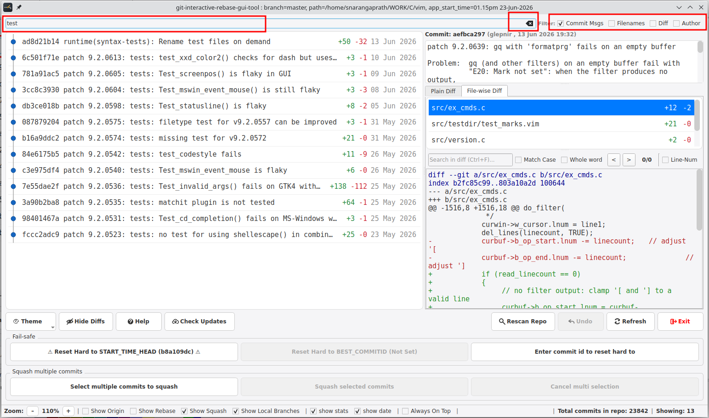

**Description:** Click the search bar or press `/` to focus it. Type to filter commits live. Press `Esc` to clear the search and return to the full history. Filtering works as you type.

---

## 5. Diff Viewer

View code changes with syntax highlighting for added and removed lines.

**Screenshot:** `screenshots/diff-viewer.png`

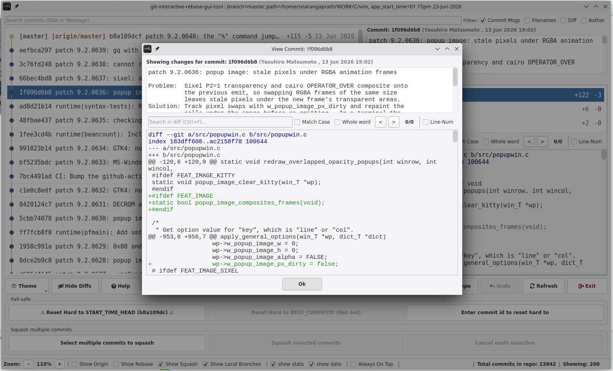

**Description:** Click any commit to view its diff in the right panel. Added lines are highlighted in green, removed lines in red. The diff is displayed in a scrollable view with line numbers.

---

## 6. File-wise View

Browse commit changes file by file.

**Screenshot:** `screenshots/file-view.png`

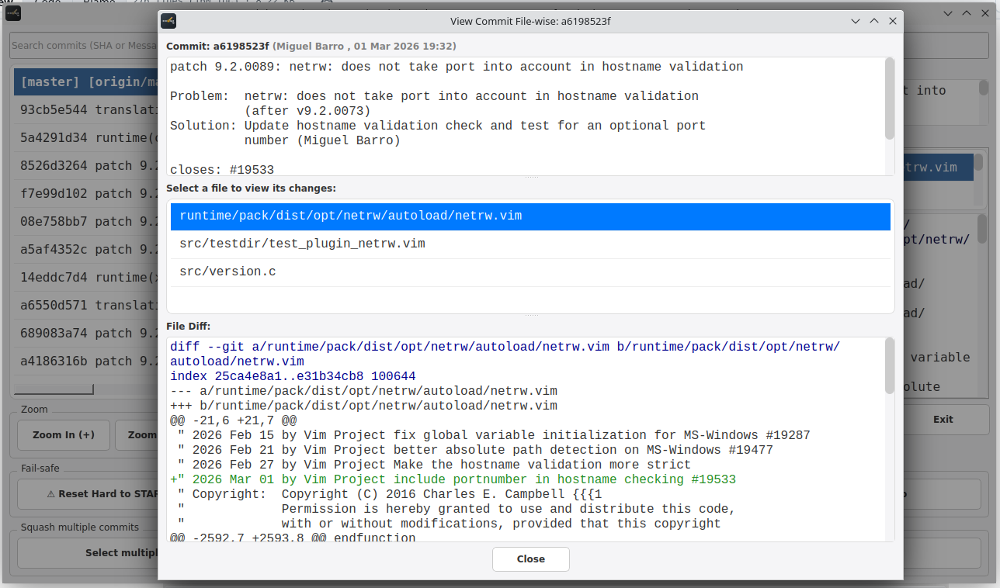

**Description:** Click the "File-wise View" button to open a dialog listing all changed files. Select any file to view its specific diff. This makes it easy to understand what each file contributed to the commit.

---

## 7. Rephrase Commit

Update the commit message without changing the commit contents.

**Screenshot:** `screenshots/rephrase-commit.png`

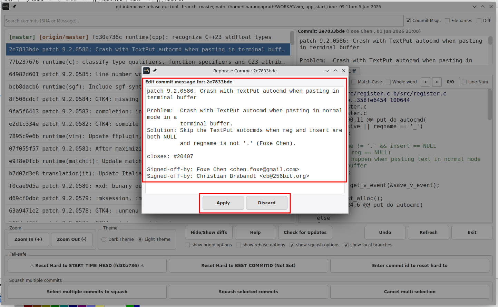

**Description:** Right-click a commit and select "Rephrase" to open the rephrase dialog. Edit the commit message and click "Confirm" to apply the new message.

---

## 8. Drop Commit

Remove a commit entirely from the history.

**Screenshot:** `screenshots/drop-commit.png`

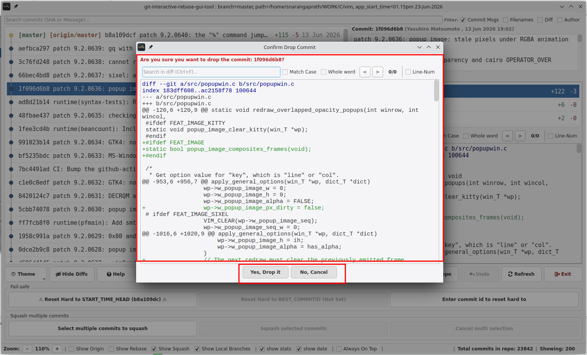

**Description:** Right-click a commit and select "Drop" to see a confirmation dialog. Confirm to remove the commit from the history. This action is irreversible without resetting.

---

## 9. Drag to Reorder

Drag commits up or down to change their order in the history.

**Screenshot:** `screenshots/drag-reorder.png`

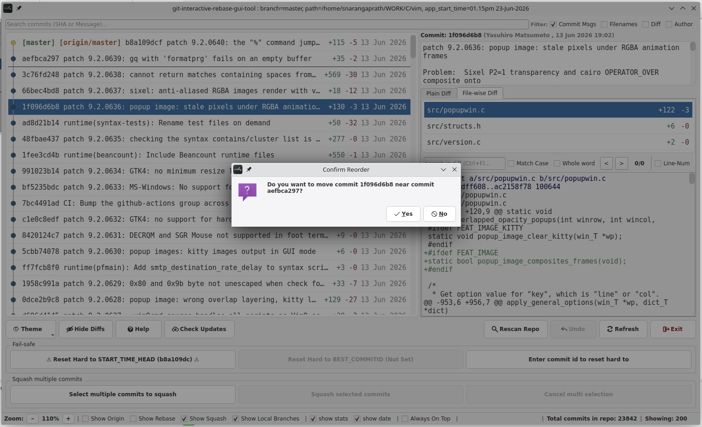

**Description:** Click and hold on any commit item, then drag it to a new position. A visual indicator shows where the commit will be placed. Drop to confirm the reorder.

---

## 10. Squash Commit with above / below commit

Combine commits into one with a custom message.

**Screenshot:** `screenshots/squash-context-menu.png` (context menu)

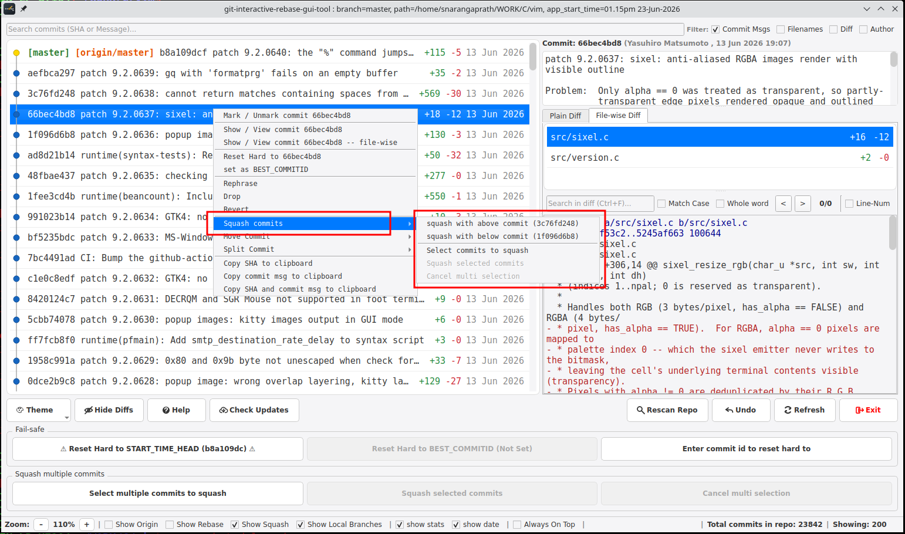

**Screenshot:** `screenshots/squash-dialogue.png` (dialog)

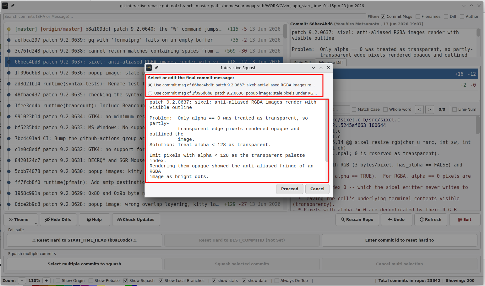

**Description:** Right-click a commit and select "Squash with above" or "Squash with below" to open the squash dialog. Edit the combined commit message and click "Confirm" to apply.

**Note:** Only adjacent commits can be squashed together.

---

## 11. Split Dialog

Break a commit into multiple smaller commits by file or change.

**Screenshot:** `screenshots/split-dialogue.png`

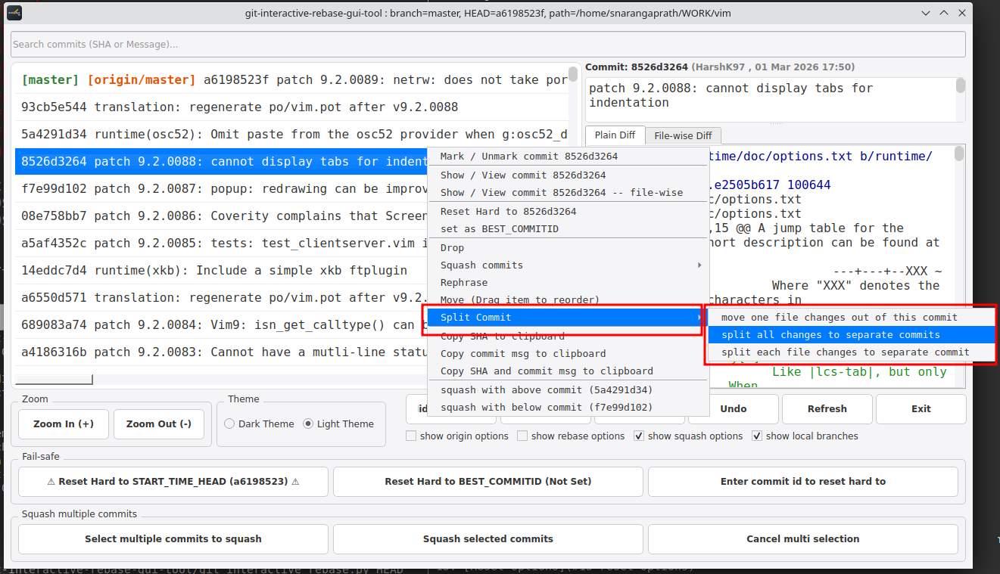

### Option 1: Move single file changes out
Move changes of a specific file to a separate commit (only for commits with single file changes).

**Screenshot:** `screenshots/split-move-single-file-1.png`

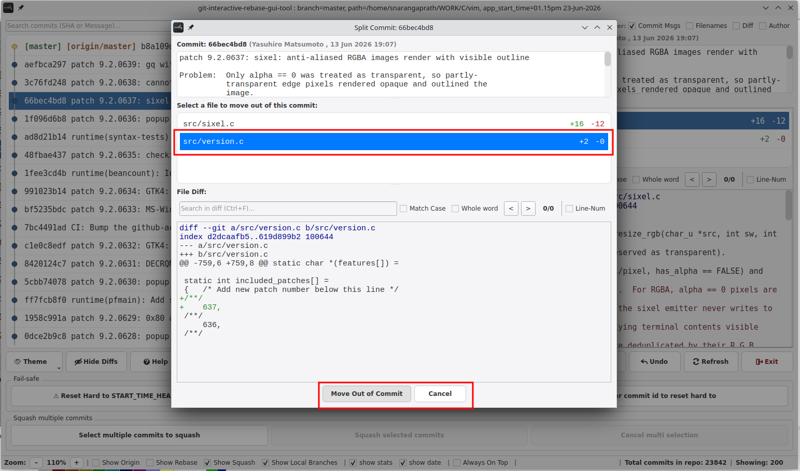

**Screenshot:** `screenshots/split-move-single-file-2.png`

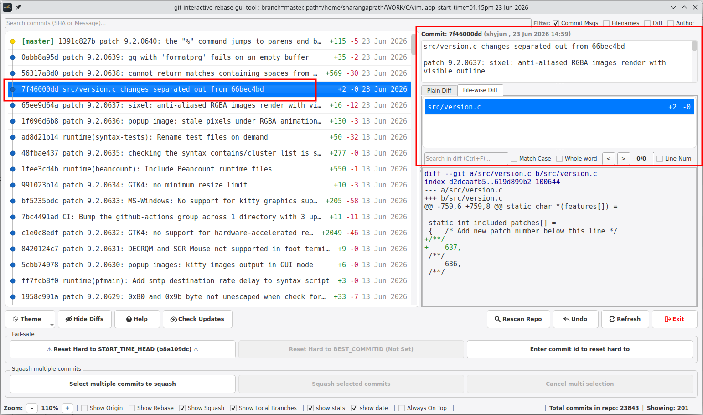

### Option 2: Split all changes to separate commits
Break all changes into individual commits per file.

**Screenshot:** `screenshots/split-all-to-separate.png`

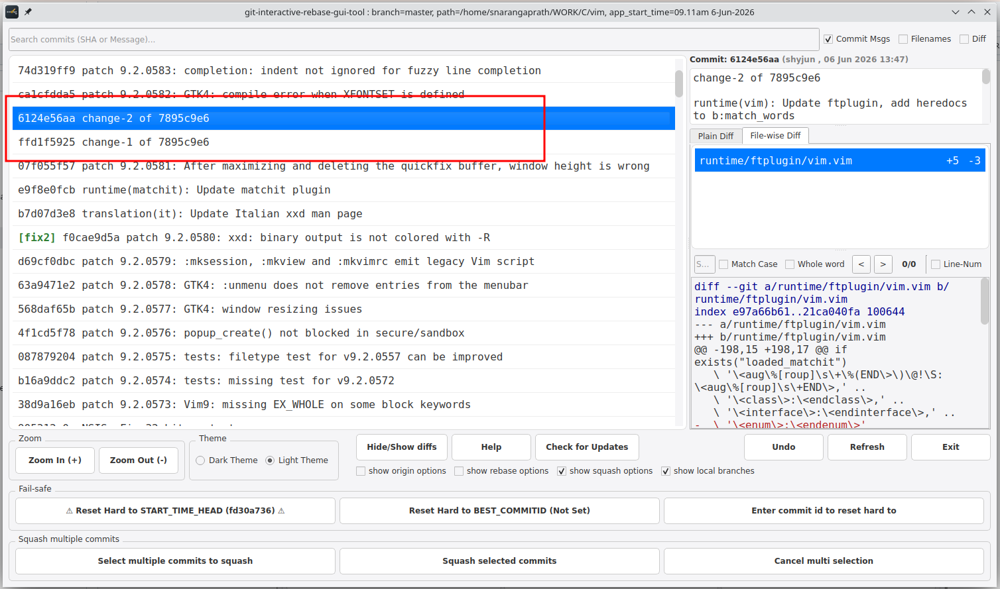

### Option 3: Split each file to separate commits
Create one commit per changed file.

**Screenshot:** `screenshots/split-each-to-separate.png`

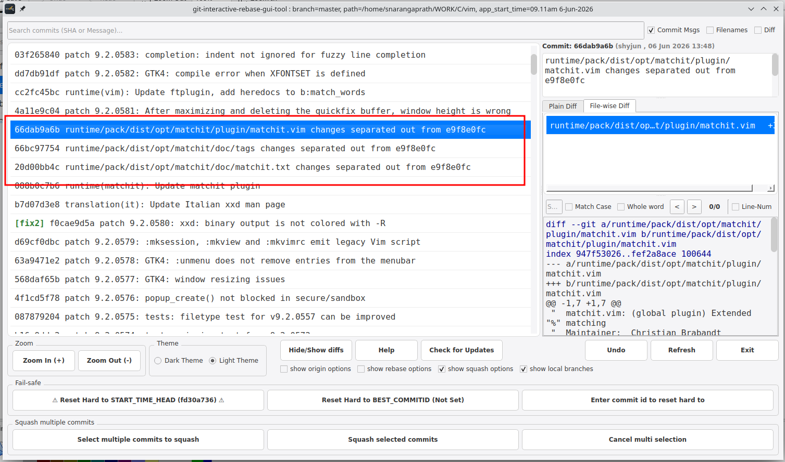

---

## 12. Light Theme

Clean and bright light theme (default).

**Screenshot:** `screenshots/light-theme.png`

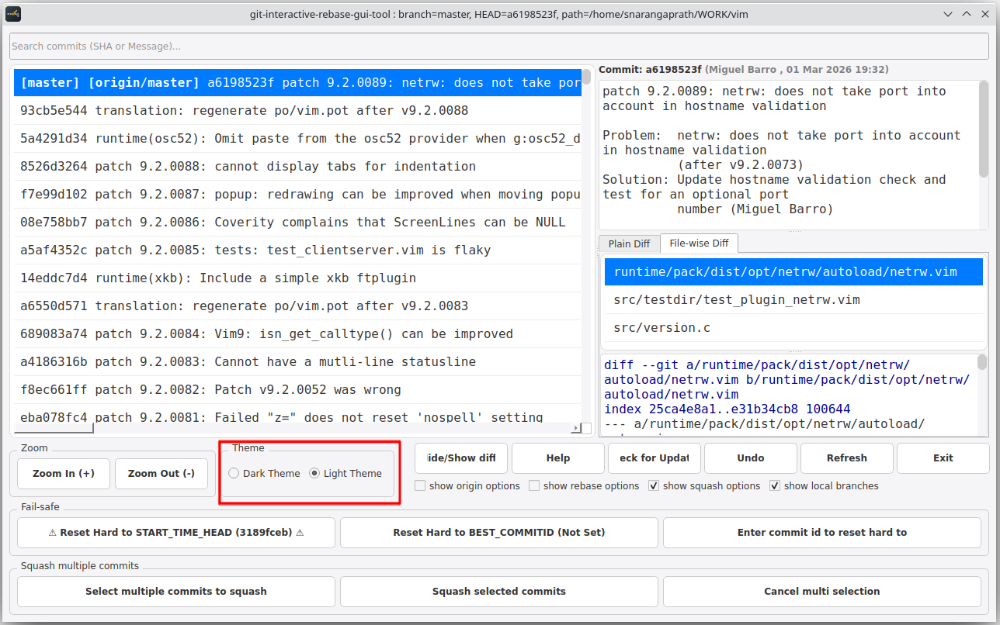

**Description:** Light theme is the default theme on first run. Provides a clean, high-contrast interface for daytime use. Click the theme toggle (sun icon) to switch themes. Theme preference is automatically saved.

---

## 13. Dark Theme

VS Code-inspired dark theme for comfortable working.

**Screenshot:** `screenshots/dark-theme.png`

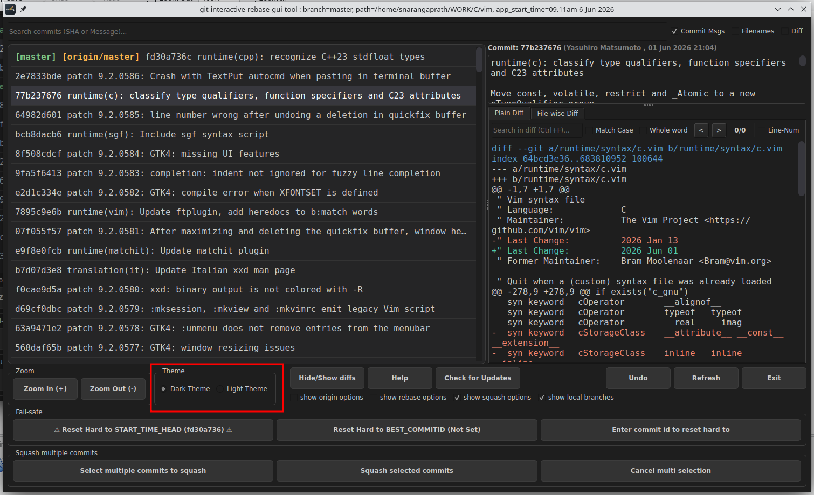

**Description:** Click the theme toggle (moon icon) to switch to dark mode. The dark theme uses a charcoal palette that is easy on the eyes. Theme preference is automatically saved.

---

## 14. Reset Options

Fail-safe options to reset your branch to a safe state.

**Screenshot:** `screenshots/reset-options.png`

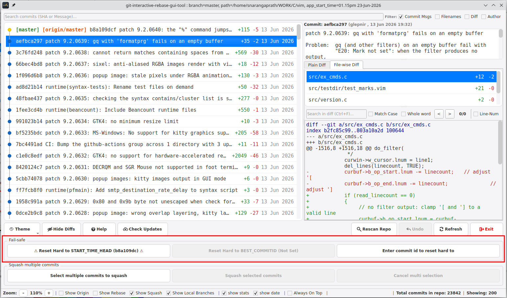

**Description:** Use the "Reset" menu to access fail-safe options:
- **Reset to Best Commit ID**: Reset to a user-defined safe commit. To set the Best Commit ID, right-click any commit and select "Set Best Commit ID"
- **Reset to Start Time Head**: Reset to the commit state when the app launched
- **Reset to Custom Commit**: Choose any commit to reset to

---

## 15. Rebase Dialog

Rebase your commits onto a different branch.

**Screenshot:** `screenshots/rebase-dialog.png`

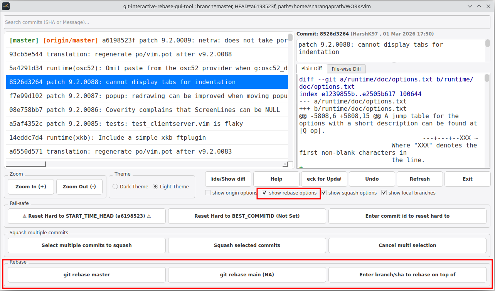

**Description:** Click "Rebase" to open the rebase dialog. Choose to rebase onto:
- master
- main
- A custom branch

The rebase runs in the background without blocking the UI.

---

## 16. Copy to Clipboard

**Screenshot:** `screenshots/copy-commit-details.png`

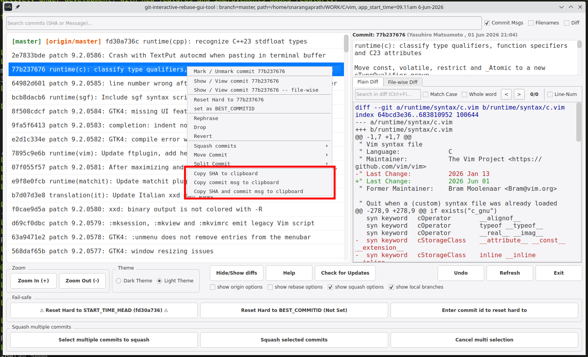

**Description:** Right-click any commit and select "Copy SHA", "Copy Message", or "Copy Both" to copy to clipboard. A "Copied!" notification appears briefly to confirm the action.

---

## 17. Zoom Controls

Adjust the font size for better readability.

**Screenshot:** `screenshots/zoom-controls.png`

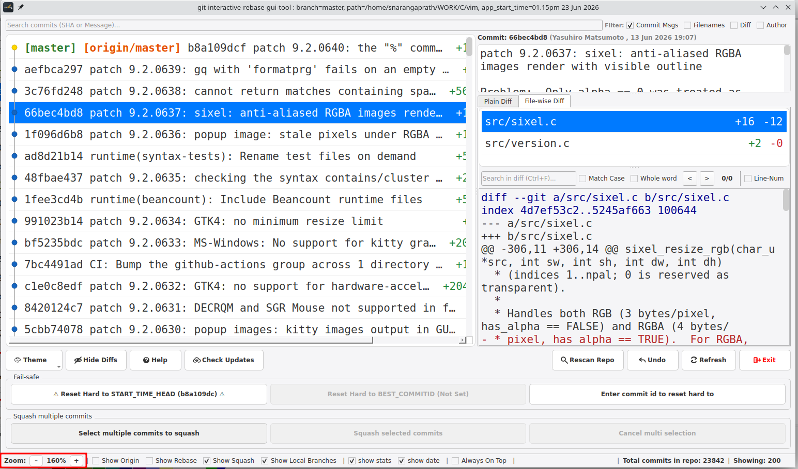

**Description:** Use the zoom controls (+/- buttons) in the toolbar to increase or decrease the font size. Font size preference is automatically saved across sessions.

---

## Keyboard Shortcuts

| Shortcut | Action |
|----------|--------|
| `/` | Focus search bar |
| `Esc` | Clear search / Close dialog |
| `F5` | Refresh commit list |
