# Screenshots & Feature Guide

Visual documentation for the Git Interactive Rebase GUI Tool. Each section showcases a feature with a screenshot and brief description.

**Note:** [Vim official repository](https://github.com/vim/vim) is used for demonstration purposes.

---

## Table of Contents

1. [Launch](#1-launch)
2. [Main Interface](#2-main-interface)
3. [Context Menu](#3-context-menu)
4. [Search & Filter](#4-search--filter)
5. [Diff Viewer](#5-diff-viewer)
    - [5.1 Diff Search](#51-diff-search)
6. [File-wise Diff Viewer](#6-file-wise-diff-viewer)
7. [Rephrase Commit](#7-rephrase-commit)
8. [Drop Commit](#8-drop-commit)
9. [Reorder Commits](#9-reorder-commits)
10. [Squash Commits](#10-squash-commits)
11. [Split Dialog](#11-split-dialog)
12. [Refine Changes in File](#12-refine-changes-in-file)
    - [12.1 Selectively Drop Changes / Hunks](#121-selectively-drop-changes--hunks)
    - [12.2 Keep Only Selected Changes / Hunks](#122-keep-only-selected-changes--hunks)
    - [12.3 Move Selected Changes to a Separate Commit](#123-move-selected-changes-to-a-separate-commit)
    - [12.4 Edit Hunk](#124-edit-hunk)
13. [Rescan Repository for Changes](#13-rescan-repository-for-changes)
14. [Reset Options](#14-reset-options)
15. [Rebase Options](#15-rebase-options)
16. [Themes (Light / Dark)](#16-themes-light--dark)
17. [Zoom Controls](#17-zoom-controls)
18. [Mark / Unmark Commit](#18-mark--unmark-commit)
19. [Show Local Branches](#19-show-local-branches)
20. [Copy to Clipboard](#20-copy-to-clipboard)
21. [Unstaged Changes Handling](#21-unstaged-changes-handling)
22. [Keyboard Shortcuts](#22-keyboard-shortcuts)

---

## 1. Launch

Launch the application by specifying a commit range or let the tool automatically detect the branch base.

### Option 1: Show commits since a specific commit (provide SHA as argument)

View commits starting from a specific commit SHA or relative HEAD reference.

You can specify commits using:

- A specific commit SHA
- `HEAD~N` to go back **N commits**
- `HEAD^^^...` where each `^` represents one commit

```bash
python3 git_interactive_rebase.py <commit-sha>
python3 git_interactive_rebase.py HEAD~N
python3 git_interactive_rebase.py HEAD^^^
````

### Option 2: Auto-detect branch base

When no commit SHA is provided, the tool automatically detects the base branch (for example, `main` or `master`) and shows commits from the branch divergence point.

If detection fails, it falls back to displaying the **200 most recent commits from HEAD**.

**Screenshot:** `screenshots/head-commits.png`


**Description:** The screenshot above shows the application launched using `python3 git_interactive_rebase.py HEAD~6`.

---

## 2. Main Interface

The main window displays your commit history in an interactive list with action controls.

**Screenshot:** `screenshots/main-interface.png`


**Description:** The main window shows the commit list with SHA, message, and branch indicators. The details panel displays commit metadata (SHA, author, date, changed files). The right side pane shows diffs in plain view or file-wise view. The top toolbar includes search, theme toggle, zoom controls, and reset options. Right-click any commit to access the context menu with all rebase actions.

---

## 3. Context Menu

Access all commit actions via right-click menu.

**Screenshot:** `screenshots/context-menu.png`


**Description:** Right-click any commit to see the context menu with all available actions:

- View full commit
- Copy SHA / Copy Message / Copy Both
- Squash with above
- Rephrase
- Drop
- Split
- Mark / Unmark commit
- Reset hard to this commit

---

## 4. Search & Filter

Quickly locate commits using live search and advanced filtering options.

**Screenshot:** `screenshots/search-filter.png`


**Description:** Click the search bar or press `/` to focus it. Type to filter commits live. Matching commits are shown instantly as you type.

Filtering supports the following modes:

- **Commit SHA** → Find commits by SHA
- **Commit Msgs** → Search commit messages
- **Filenames** → Search commits that modified a specific file
- **Diff** → Search inside commit diff/content

You can enable one or multiple filter modes at the same time for more precise searching.

This is especially useful when trying to locate where a change was introduced and you only remember a filename, symbol, function name, commit message, or code snippet.

Press `Esc` to clear the search and return to the full commit history.

---

## 5. Diff Viewer

View code changes with syntax highlighting for added and removed lines.

**Screenshot:** `screenshots/diff-viewer.png`


**Description:** Click any commit to view its diff in the right panel. Added lines are highlighted in green, removed lines in red. The diff is displayed in a scrollable view with line numbers.

---

### 5.1 Search in Diff

Quickly search for text inside the displayed diff.

**Screenshot:** `screenshots/diff-search.png`

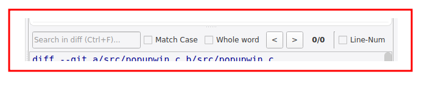

**Description:** Press `Ctrl+F` while viewing a diff to open the diff search bar.

Search supports:

- **Match Case** → Match exact letter case
- **Whole Word** → Match complete words only
- **Previous / Next navigation (`<` / `>`)** → Jump between matches
- **Match counter** → Shows current match position (e.g., `2/10`)

Press `Esc` to close the search bar.

---

## 6. File-wise Diff Viewer

Browse commit changes file by file.

**Screenshot:** `screenshots/file-wise-diff-viewer.png`

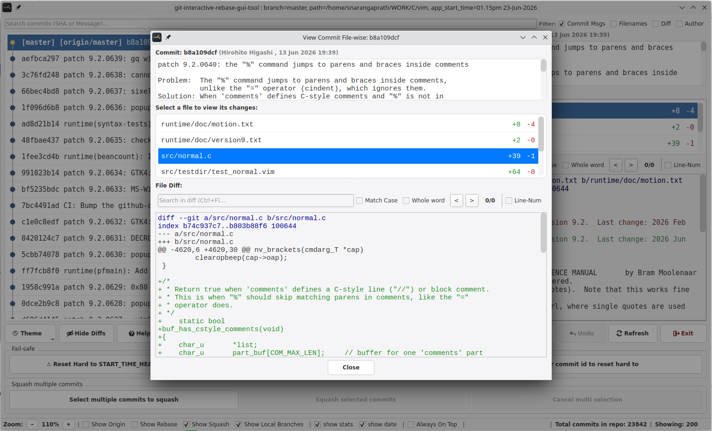

**Description:** Click the "File-wise View" button to open a dialog listing all changed files. Select any file to view its specific diff. This makes it easy to understand what each file contributed to the commit.

---

## 7. Rephrase Commit

Update the commit message without changing the commit contents.

**Screenshot:** `screenshots/rephrase-commit.png`


**Description:** Right-click a commit and select "Rephrase" to open the rephrase dialog. Edit the commit message and click "Confirm" to apply the new message.

---

## 8. Drop Commit

Remove a commit entirely from the history.

**Screenshot:** `screenshots/drop-commit.png`


**Description:** Right-click a commit and select "Drop" to see a confirmation dialog. Confirm to remove the commit from the history. This action is irreversible without resetting.

---

## 9. Reorder Commits

Change commit order to organize history before rebasing.

**Screenshot:** `screenshots/drag-reorder.png`


**Description:** Reorder commits using either drag-and-drop or quick move actions from the context menu.

Available options include:

- **Drag to Reorder** → Click and drag a commit to a new position in the history
- **Move Up / Move Down** → Move a commit relative to nearby commits using the context menu
- **Swap with Above / Below Commit** → Quickly exchange positions with adjacent commits

A visual indicator shows where the commit will be placed before confirming the reorder.

---

## 10. Squash Commits

Combine multiple commits into one.

### Option 1: Squash Commit with above / below commit

Squash a commit with its immediate neighbor (above or below).

**Screenshot:** `screenshots/squash-context-menu.png` (context menu)


**Screenshot:** `screenshots/squash-dialogue.png` (dialog)


**Description:** Right-click a commit and select "Squash with above" or "Squash with below" to open the squash dialog. You can either select a commit message from one of the commits being squashed, or enter your own custom commit message. Click "Confirm" to apply.

### Option 2: Select multiple commits and squash them together

Squash multiple adjacent commits at once.

**Screenshot:** `screenshots/multi-squash.png`

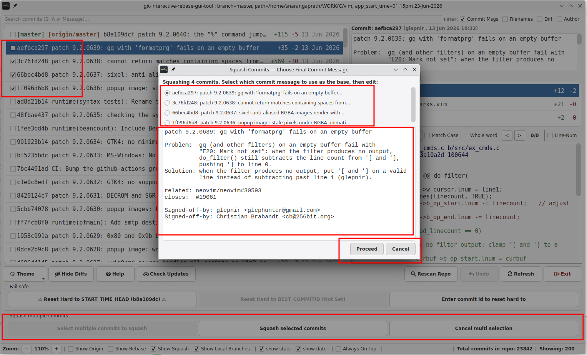

**Description:** Switch to multiple commit selection mode using the highlighted button in the toolbar (or via the context menu), then select multiple adjacent commits by clicking on them. Once selected, click the "Squash selected commits" button (or use the context menu) to open the squash dialog. Edit the combined commit message in the dialog and click "Confirm" to apply.

To exit multi-selection mode without squashing, click the cancel multi-selection button (or use the context menu) to deselect and return to normal mode.

---

## 11. Split Dialog

Break a commit into multiple smaller commits by file or change.

**Screenshot:** `screenshots/split-context-menu.png`

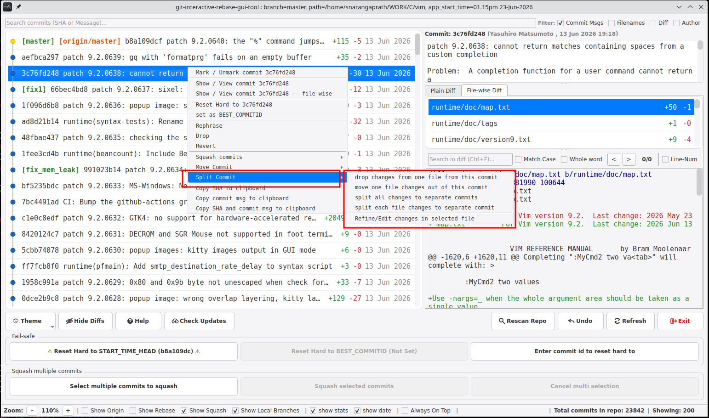

### Option 1: Move single file changes out of a commit

Move changes of a specific file to a separate commit (only for commits with multiple file changes).

**Screenshot:** `screenshots/split-move-single-file-1.png`


**Screenshot:** `screenshots/split-move-single-file-2.png`


### Option 2: Split each file changes to separate commits

Available only in commits with multiple file changes. Creates one commit per changed file.

**Screenshot:** `screenshots/split-each-to-separate.png`


### Option 3: Split all changes in one file to separate commits

Breaks all changes in a single file into individual commits per file change. Available only in commits with single file changes.

**Screenshot:** `screenshots/split-all-to-separate.png`


---

## 12. Refine Changes in File

Selectively refine changes/hunks inside a file within a commit.

This is useful when a file accidentally contains mixed changes such as feature work, debug code, documentation updates, or unrelated edits.

**Screenshot:** `screenshots/refine-changes-in-file.png`

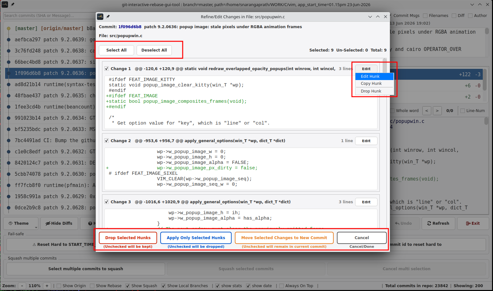

**Description:** Select one or more hunks using the checkboxes. Use **Select All / Deselect All** to quickly adjust selection. Depending on the action chosen, selected or unselected hunks are retained, removed, or moved.

---

### 12.1 Selectively Drop Changes / Hunks

Drop only selected changes/hunks from a file while keeping the remaining changes in the commit intact.

**Description:** Select the hunks to remove and click **"Drop Selected Hunks"**.

- **Checked hunks** → Removed from the commit
- **Unchecked hunks** → Kept in the commit

Useful for removing accidental debug code, temporary changes, or unrelated edits.

---

### 12.2 Keep Only Selected Changes / Hunks

Keep only selected changes/hunks and drop everything else from the file within the commit.

**Description:** Select the hunks you want to retain and click **"Apply Only Selected Hunks"**.

- **Checked hunks** → Kept in the commit
- **Unchecked hunks** → Dropped from the commit

Useful when a commit contains mixed or unrelated changes and only part of it should remain.

---

### 12.3 Move Selected Changes to a Separate Commit

Move selected changes/hunks into a new separate commit.

**Description:** Select the hunks to move and click **"Move Selected Changes to New Commit"**.

- **Checked hunks** → Moved to a new commit
- **Unchecked hunks** → Remain in the current commit

Useful when a change accidentally landed in the wrong commit. Move it out, reorder the new commit, and squash it with the intended commit later.

---

### 12.4 Edit Hunk

Edit a selected hunk using a lightweight patch editor.

**Screenshot:** `screenshots/edit-hunk.png`

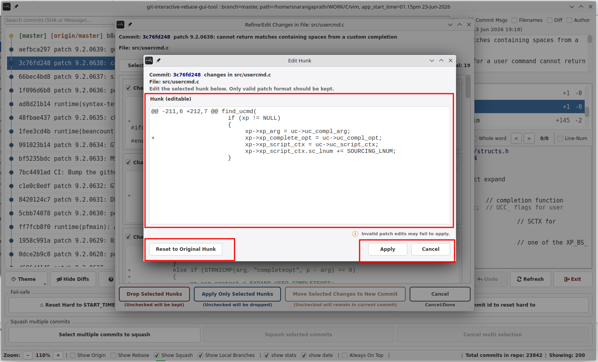

**Description:** Right-click a hunk and choose **"Edit Hunk"** to manually modify the patch content before applying changes.

The editor allows fine-grained cleanup of a hunk by directly editing the patch text.

Features include:

- **Editable patch content** → Modify added/removed lines directly
- **Reset to Original Hunk** → Restore the original patch if needed
- **Apply** → Save valid patch changes
- **Cancel** → Discard edits

> **Note:** Only valid patch/diff format edits are supported. Invalid edits may fail to apply.

Useful for quickly cleaning up accidental changes, temporary code, debug prints, small formatting fixes, or unwanted lines before finalizing commit history.

---

## 13. Rescan Repository for Changes

Detect newly introduced unstaged or uncommitted changes while the application is already running.

**Screenshot:** `screenshots/rescan-repository.png`

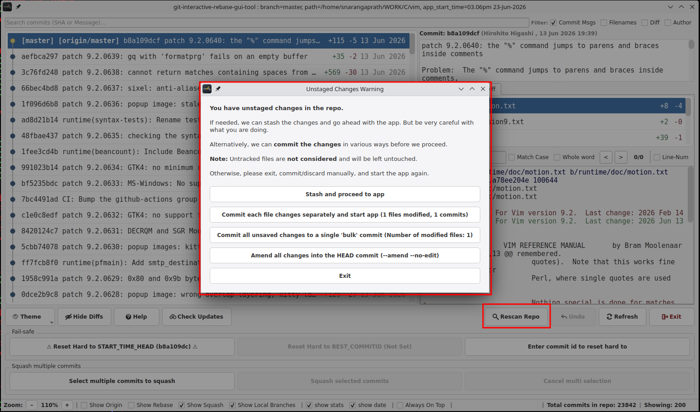

**Description:** The application can remain open while you continue working in your editor or terminal. If new unstaged or uncommitted changes are introduced outside the tool, use **Rescan Repository** to re-evaluate the repository state.

When changes are detected, the tool provides the same safe handling options available during startup, allowing you to:

- Stash changes and continue
- Commit each file separately
- Commit all changes into a single bulk commit
- Amend all changes to the current `HEAD` commit
- Cancel and resolve changes manually

This makes it easy to keep the application open throughout a development session while safely incorporating newly created changes into your interactive rebase workflow.

---

## 14. Reset Options

Fail-safe options to reset your branch to a safe state.

**Screenshot:** `screenshots/reset-options.png`


**Description:** Use the "Reset" menu to access fail-safe options:

- **Reset to Best Commit ID**: Reset to a user-defined safe commit. To set the Best Commit ID, right-click any commit and select "Set Best Commit ID"
- **Reset to Start Time Head**: Reset to the commit state when the app launched
- **Reset to Custom Commit**: Choose any commit to reset to

---

## 15. Rebase Options

Rebase your commits onto a different branch.

**Screenshot:** `screenshots/rebase-options.png`

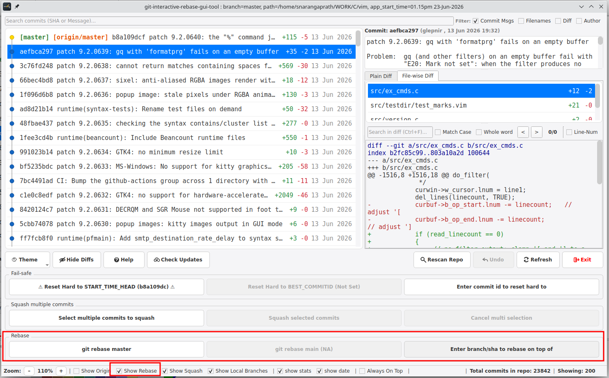

**Description:** Click "Rebase" to open the rebase dialog. Choose to rebase onto:

- master
- main
- A custom branch

The rebase runs in the background without blocking the UI.

---

## 16. Themes (Light / Dark)

Toggle between light and dark themes for comfortable viewing.

> **Note:** Most screenshots in this documentation use the **light theme (default)**.

**Screenshot:** `screenshots/dark-theme.png`


**Description:** Switch between light and dark themes to suit your preference. The light theme (default) provides a clean, high-contrast interface for daytime use, while the dark theme features a VS Code-inspired charcoal palette that is easy on the eyes during extended sessions. Click the theme toggle (sun/moon icon) to switch. Theme preference is automatically saved across sessions.

---

## 17. Zoom Controls

Adjust the font size for better readability.

**Screenshot:** `screenshots/zoom-controls.png`


**Description:** Use the zoom controls (+/- buttons) in the toolbar to increase or decrease the font size. Font size preference is automatically saved across sessions.

---

## 18. Mark / Unmark Commit

Mark commits for easy identification.

**Screenshot:** `screenshots/mark-commits.png`

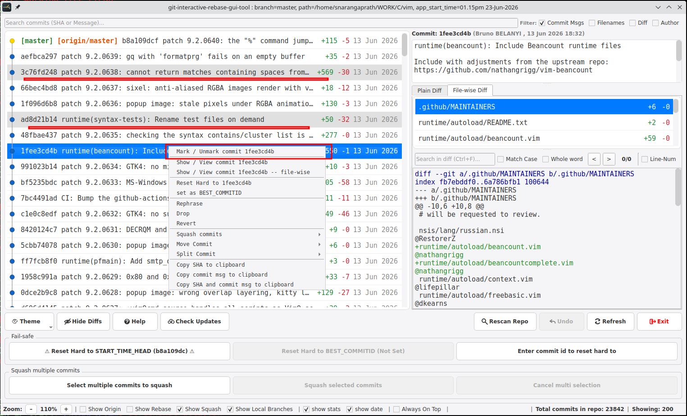

**Description:** Right-click any commit and select "Mark / Unmark commit" to toggle a mark. Marked commits display with a distinct background color for easy identification. This helps you keep track of important commits like releases, milestones, or commits that need further attention. Right-click again to unmark.

**Note:** In the screenshot, the 2nd and 4th commits are already marked.

---

## 19. Show Local Branches

Display local and remote branch names alongside commits.

**Screenshot:** `screenshots/show-local-branches.png`

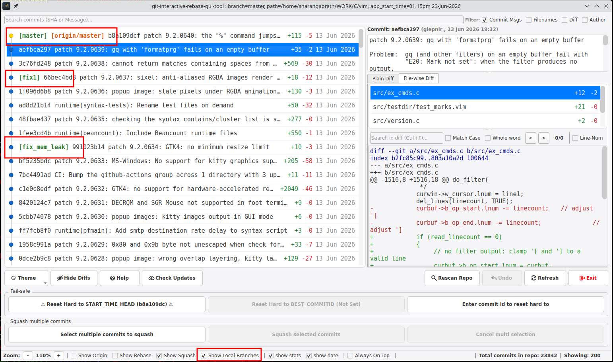

**Description:** Toggle the "show local branches" checkbox to display branch names next to commits. Local branches are shown in green, and remote branches (e.g., origin/main, origin/master) are shown in orange. This helps you identify which branch a commit belongs to or originated from, making it easier to understand the commit's context and lineage.

**Note:** In the screenshot, local branches feat1, master, and memleak_fix are visible.

---

## 20. Copy to Clipboard

Quickly copy commit details for sharing, debugging, or reference.

**Screenshot:** `screenshots/copy-commit-details.png`


**Description:** Right-click any commit and select one of the following options:

- **Copy SHA** → Copy the commit SHA
- **Copy Message** → Copy the commit message
- **Copy Both** → Copy both SHA and commit message

A brief **"Copied!"** notification appears to confirm the action.

---

## 21. Unstaged Changes Handling

Safely launch the application even when the repository contains unstaged or uncommitted changes.

When unstaged changes are detected, the tool pauses startup and provides multiple safe options before continuing.

**Screenshot:** `screenshots/unstaged-changes-warning.png`

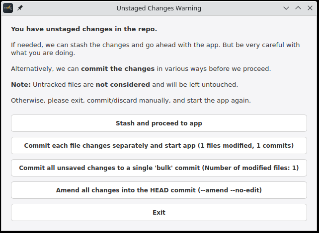

**Description:** If unstaged or uncommitted changes are detected during launch, the tool shows a warning dialog and provides multiple ways to safely proceed.

Available options include:

- **Stash and proceed to app** → Temporarily stash current changes and launch the application. When exiting the app, if it was launched this way, you are prompted to directly **stash pop** and restore the changes.
- **Commit each file changes separately and start app** → Automatically create one commit per modified file before launch
- **Commit all unsaved changes to a single "bulk" commit** → Save all current changes into one temporary commit and continue
- **Amend all changes to the current `HEAD` commit** → Ament HEAD commit with the unstaged changes
- **Exit** → Cancel launch and resolve changes manually

> **Note:** Untracked files are **not considered** during this process and are left untouched (not stashed or modified).

This helps prevent accidental data loss or conflicts while rewriting commit history using interactive rebase operations.

---

## 22. Keyboard Shortcuts

Keyboard shortcuts for faster navigation and workflow.

| Shortcut | Action |
|----------|--------|
| `/` | Focus the commit search bar |
| `Esc` | Clear search, close dialogs, or exit search mode |
| `Ctrl+F` | Open search in diff viewer |
| `Ctrl+Q` | Exit the application |
| `F5` | Refresh commit list |

**Notes:**

- `Esc` behaves contextually and may close dialogs, clear filters, or exit search depending on the active view.
- `Ctrl+F` works inside the diff viewer and opens the inline diff search bar.
